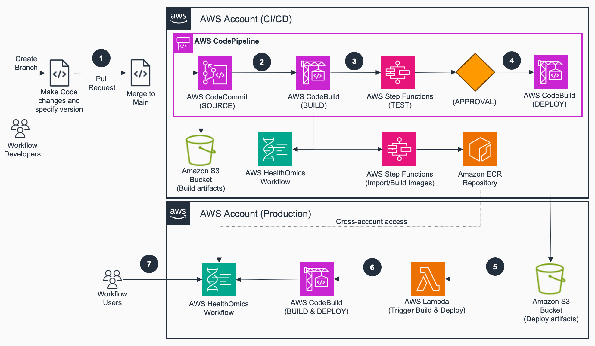
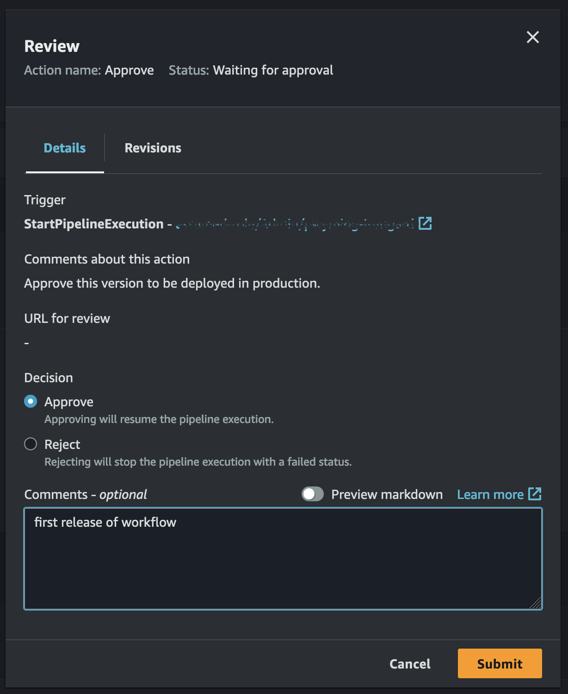

# Guidance for Bioinformatics workflow development using DevOps on AWS

## Table of Contents

- [Guidance for Bioinformatics workflow development using DevOps on AWS](#guidance-for-bioinformatics-workflow-development-using-devops-on-aws)
  - [Table of Contents](#table-of-contents)
  - [Overview](#overview)
    - [Cost](#cost)
  - [Prerequisites](#prerequisites)
    - [Operating System](#operating-system)
    - [Additional tools](#additional-tools)
    - [AWS account requirements](#aws-account-requirements)
    - [Supported Regions](#supported-regions)
  - [Deployment Steps](#deployment-steps)
  - [Deployment Validation](#deployment-validation)
  - [Running the Solution with an example Workflow](#running-the-solution-with-an-example-workflow)
  - [Next Steps](#next-steps)
  - [Cleanup](#cleanup)
  - [FAQ, known issues, additional considerations, and limitations](#faq-known-issues-additional-considerations-and-limitations)
    - [Additional considerations](#additional-considerations)
    - [Semantic versioning](#semantic-versioning)
    - [Branching strategies](#branching-strategies)
      - [Trunk-based](#trunk-based)
      - [Gitflow](#gitflow)
  - [Revisions](#revisions)
  - [\[Unreleased\]](#unreleased)
    - [Added](#added)
  - [Notices](#notices)

## Overview

Bioinformatics workflows for omics are software, and like any other software product they have source control and versions that need to be tracked, tested, and released when ready for wider use. This also applies to workflows used with [AWS HealthOmics](https://aws.amazon.com/healthomics/) workflows.  Building, testing, and deploying new workflow versions is undifferentiated heavy lift. This solution makes the cloud resources for automated testing and deployment of bioinformatics workflows easy to acquire, provision, and use.

> **NOTE:** Current version of the solution is compatible with **Nextflow** workflows only and supports one target production account. The solution can be extended to other workflow languages supported by AWS HealthOmics (WDL and CWL) and multiple production accounts by making appropriate code changes in the build and CDK scripts.

**Features provided by this solution include:**
* Automated container build or migrations from public docker registries  
* Automated tests using user defined test data
* Semantic Versioning and automated version updates
* Cross Account deployments  
    * secure build  
    * environment isolation  
    * safe deployments  
* Cross Account docker image access
* Workflow and artifact tagging for data provenance



The steps involved are generally the same across all organizations:

1. Workflow developers create a branch and write code for a new workflow or make changes to an existing workflow repository within AWS CodeCommit. Developers can specify major and minor version as part of semantic versioning. Since AWS CodeCommit supports Git, developers use git operations to push code, submit a pull request and merge to the ‘main’ branch. This triggers the CI/CD pipeline configured with AWS CodePipeline.
2. Within AWS CodePipeline, the build process is triggered using AWS CodeBuild, where 1/ the latest source code is downloaded, 2/ using a pre-created AWS Step Functions state machines, import public docker images or build new docker images and store within Amazon Elastic Container Registry (ECR) repositories, 3/ artifacts for the AWS HealthOmics workflow are prepared and stored in Amazon S3, and an AWS HealthOmics workflow is created with the user defined semantic version and an auto-updated patch version
3. Once the workflow is set up in AWS HealthOmics, an AWS Step Functions State Machine is triggered to test the HealthOmics workflow with some preconfigured test data. The state machine runs the HealthOmics workflow and waits for it to complete successfully.
4. On successful completion of the test workflow, a user can review the test workflow outputs and manually approve the deployment of the workflow to a production AWS account. The approval action triggers an AWS CodeBuild job which prepares the workflow artifacts and uploads them to the production account’s Amazon S3 bucket. In addition, cross-account permissions are granted for the production account to access Amazon ECR repository images from the CI/CD account.
5. When workflow artifacts are uploaded to the production account’s Amazon S3 bucket, an AWS Lambda function is triggered which checks for the necessary files and launches an AWS CodeBuild job. 
6. The AWS CodeBuild job creates the workflow in AWS HealthOmics using the artifacts in S3.
7. The AWS HealthOmics workflow is now available for use in the production account.


The steps above are conceptually no different that those taken for other software products. The primary difference is the time scale involved. Workflow run times are dependent on the size of input data used, and test driven iteration times can be on the order of hours. Optimizing iteration times is out of scope for this solution. 


### Cost

_You are responsible for the cost of the AWS services used while running this Guidance. As of March 2024, the cost for running this Guidance with the default settings in the US East (N. Virginia) region is approximately $5.00 per month for processing 30 builds and production deployments of a workflow that uses up to 10 container images in one month._

The above is for the base cost of the services used for CI/CD, which include:
- AWS CodeCommit
- AWS CodeBuild
- AWS CodePipeline
- AWS StepFunctions
- Amazon Elastic Container Registry

Costs for dynamic testing of workflows on AWS HealthOmics will vary depending on the workflow tasks defined and test data used.

## Prerequisites

### Operating System

Assuming all prerequisites are installed, the guidance can be deployed using the command line from Linux, Mac, and Windows operating systems.

These deployment instructions are optimized to work best on **Amazon Linux 2023**. Deployment in another OS may require additional steps.

### Additional tools

Make sure you have the following tools installed:

- [AWS CLI](https://aws.amazon.com/cli/)
- [AWS CDK](https://docs.aws.amazon.com/cdk/v2/guide/getting_started.html)
- (Recommended) [Git Remote CodeCommit](https://pypi.org/project/git-remote-codecommit/)

During deployment this guidance will install the [Amazon ECR helper for AWS HealthOmics](https://github.com/aws-samples/amazon-ecr-helper-for-aws-healthomics) CDK application to your AWS accounts to enable migration of publicly available docker images or building new docker images

### AWS account requirements

This deployment requires at least 2 AWS accounts (e.g. "cicd" and "production") where you have:
- the [AdministratorAccess AWS managed policy](https://docs.aws.amazon.com/aws-managed-policy/latest/reference/AdministratorAccess.html) granted to your calling identity
  - required for your "cicd" account
  - can be scoped down for your "production" account
- both console and programamtic access 

### Supported Regions

This guidance is best suited for regions where AWS HealthOmics is [available](https://docs.aws.amazon.com/general/latest/gr/healthomics-quotas.html).

## Deployment Steps


1. Clone this repository.
    ```bash
    git clone https://github.com/aws-solutions-library-samples/guidance-for-bioinformatics-workflow-ci-cd-on-aws.git
    ```

2. Configure AWS CLI profiles for the accounts you wish to use.
   
   Select at least two AWS accounts to deploy the solution into. By default, this guidance works with one CI/CD and one deployment (e.g. production) account, but can be extended to work with additional accounts.

   This guidance uses the AWS CDK to deploy resources which uses AWS CLI profiles to access AWS environments. Profiles for `cicd` and `production` need to be configured.

    ```bash
    aws configure --profile cicd
    # ... follow CLI prompts to complete

    aws configure --profile prod
    # ... follow CLI prompts to complete
    ```

    Additional documentation for profile setup is available [here](https://docs.aws.amazon.com/cli/latest/userguide/cli-configure-files.html).

3. Bootstrap the AWS accounts you selected with the AWS CDK.
   
   > **NOTE:** Perform the bootstrapping commands __OUTSIDE__ of the project folder, like your home folder (`~`).

   Bootstrapping provisions resources used by the AWS CDK to deploy AWS CDK apps into an AWS environment. (An AWS environment is a combination of an AWS account and Region). These resources include an Amazon S3 bucket for storing files and IAM roles that grant permissions needed to perform deployments.  

    Because this solution leverages cross-account access, the bootstrap process is a little more complex than a single-account case, requiring creating trust relationships between accounts.

    Start by bootstrapping the `cicd` account. This is the account that will contain workflow and container source code, run tests, and deploy to other accounts.
    ```bash
    cdk bootstrap \
        --profile cicd \
        aws://<CICD_AWS_ACCOUNT_ID>/<AWS_REGION> \
        --cloudformation-execution-policies arn:aws:iam::aws:policy/AdministratorAccess
    ```

    Next bootstrap the `prod` account. This account will have "released" workflows deployed into it. Thus, it need needs to have a trust relationship with the `cicd` account (that account that invokes the deployment).
    ```bash
    cdk bootstrap \
        --profile prod \ 
        --trust <CICD ACCOUNT_ID> \ 
        aws://<PROD_AWS_ACCOUNT_ID>/<AWS_REGION> \ 
        --cloudformation-execution-policies arn:aws:iam::aws:policy/AdministratorAccess
    ```

4. Change directory to the current repository folder and install `npm` packages
    ```bash
    cd guidance-for-bioinformatics-workflow-development-using-devops-on-aws
    npm install
    ```

5. Configure the deployment

    NOTE: Use the steps below as a general guidance. To try running the solution with an example workflow and test data, you can use the example provided later in the README: [Running the Solution with an example Workflow](#running-the-solution-with-an-example-workflow)
   
   1. Add the AWS accounts you will use.

        Edit the [cdk.json](cdk.json) file.

        Add the following properties to the `context` property in the json (replace with your own account IDs and AWS region):  

        ```json
            "cicd_account": "111122223333",
            "test_account": "111122223333",
            "prod_account": "777788889999",
            "aws_region": "<aws-region>",    
        ```
         
        In this solution, there are 3 deployment stages (AWS accounts) configured. The `cicd` and `test` are configured to be the same account. You can make these different accounts if needed. Just remember to bootstrap any additional accounts you use. 
            
        > :warning: WARNING :warning:
        > Always remove sensitive information like account numbers from configuration files before sharing them publicly (e.g. pushing to a public repo).  
   
   2. Add workflow source repositories
        
        Edit the `context.workflows` property in the [cdk.json](cdk.json) file. This is a mapping of workflow names and their corresponding CodeCommit repository names.

        Examples:
        ```json
        "workflows": {
            "workflow-a": "codecommit-repo-for-workflow-a",
            "workflow-b": "codecommit-repo-for-workflow-b",
            ... 
        }
        ```

        The CodeCommit repositories can be ones that already exist in your `cicd` account or ones you plan to create later.

        During deployment, the following resources are created for each workflow listed in `context.workflows`:
        - An AWS CodeBuild project to build workflow artifacts like containers
        - An AWS CodeBuild project to deploy the workflow to AWS HealthOmics and artifacts to testing and production environments.
        - An AWS Step Functions state machine to orchestrate an AWS HealthOmics workflow test with pre-configured test data.
        - An AWS CodePipeline pipeline to coordinate testing and deployment of the workflow

        The CodePipeline pipeline references a AWS CodeCommit repository by name, and will be triggered to run with any commited changes to the `main` branch therein. If this repository does not exist, you need to create it.
    
    3. Add S3 URIs for any read-only datasets used during testing.

        Edit the `context.source_data_s3_uris` property in the [cdk.json](cdk.json) file. This is a list of S3 URIs that the CI/CD automation will be granted **read-only** access to.

        Examples:
        ```json
        "source_data_s3_uris": [
            "s3://entire-bucket/*",
            "s3://bucket/entire-folder/*",
            "s3://bucket-with-wildcard-name-*/*",
            "s3://bucket/specific/object"
            ... 
        ]
        ```

6. Deploy the solution. 
   
   The following command will deploy resources in your CI/CD, testing, and production accounts.
   ```bash
   cd guidance-for-bioinformatics-workflow-ci-cd-on-aws
   npx cdk deploy --profile cicd --all
   ```

    If you update any of the workflows or accounts used by the solution, you will need to redeploy by running the above command again.


## Deployment Validation

When successfully deployed, at least three stacks will be created and terminal output should look like:

```bash

✨  Synthesis time: 2.25s

OmicsCicdCommonStack
OmicsCicdCommonStack: deploying... [2/3]

 ✅  OmicsCicdCommonStack

✨  Deployment time: n.nns

Outputs:
OmicsCicdCommonStack.HealthOmicsStateMachineRole = arn:aws:iam::{{CICD_AWS_ACCOUNT_ID}}:role/RunHealthOmicsWorkflowStateMachineRole
OmicsCicdCommonStack.OmicsCicdCodeBuildRole = arn:aws:iam::{{CICD_AWS_ACCOUNT_ID}}:role/omicsCiCdCodeBuildRole
OmicsCicdCommonStack.OmicsCicdCodePipelineRole = arn:aws:iam::{{CICD_AWS_ACCOUNT_ID}}:role/omicsCodePipelineRole
OmicsCicdCommonStack.OmicsCicdTestDataBucket = test-files-omics-cicd-{{CICD_AWS_ACCOUNT_ID}}-us-west-2
OmicsCicdCommonStack.OmicsTesterRole = arn:aws:iam::{{CICD_AWS_ACCOUNT_ID}}:role/OmicsCicdCommonStack-omicsTesterRoleA7337E5B-t651E9kWmgPf
Stack ARN:
arn:aws:cloudformation:us-west-2:{{CICD_AWS_ACCOUNT_ID}}:stack/OmicsCicdCommonStack/3d9c35a0-cf68-11ee-affe-0ad6f320a581

✨  Total time: n.nns

OmicsCicdPerWorkflowStack
OmicsCicdPerWorkflowStack: deploying... [3/3]

 ✅  OmicsCicdPerWorkflowStack

✨  Deployment time: n.nns

Stack ARN:
arn:aws:cloudformation:us-west-2:{{CICD_AWS_ACCOUNT_ID}}:stack/OmicsCicdPerWorkflowStack/7ecc6590-cf72-11ee-81d9-02e23a17a6d7

✨  Total time: n.nns

testSupportResourcesStack
testSupportResourcesStack: deploying... [1/3]

 ✅  OmicsCicdDeployResourcesStack

✨  Deployment time: n.nns

Stack ARN:
arn:aws:cloudformation:us-west-2:{{PROD_AWS_ACCOUNT_ID}}:stack/OmicsCicdDeployResourcesStack/51356b50-cf76-11ee-8e95-02091ab9daa5

✨  Total time: n.nns
```

You can also verify these stacks using the AWS CLI.

In your `cicd` account use:
```bash
aws cloudformation describe-stacks --profile cicd --query 'Stacks[?starts_with(StackName, `OmicsCicd`)]'
```

In your `prod` account use:
```bash
aws cloudformation describe-stacks --profile prod --query 'Stacks[?starts_with(StackName, `OmicsCicd`)]'
```

## Running the Solution with an example Workflow 

To demonstrate running this CI/CD solution users can use the [NF-Core/FASTQC example-workflow](https://github.com/aws-samples/amazon-omics-tutorials/tree/main/example-workflows/nf-core/workflows/fastqc) available via the [AWS HealthOmics Tutorials](https://github.com/aws-samples/amazon-omics-tutorials) repository.

The following instructions assume you have cloned the solution repository to your `$HOME` folder on a Linux based OS (typically located at `~`).

1. Create a repository for the workflow in CodeCommit in the `cicd` AWS account

    ```bash
    aws codecommit create-repository \
        --repository-name aws-healthomics-nf-core-fastqc \
        --profile cicd
    ```

2. Clone the CodeCommit repository locally.

   > **NOTE:** Do this outside of the solution repo, like in your home (`~`) folder. The command below uses the [git-remote-codecommit](https://github.com/aws/git-remote-codecommit) package which simplifies accessing CodeCommit repositories.
   
   ```bash
   cd ~
   git clone codecommit://cicd@aws-healthomics-nf-core-fastqc
   ```

   This should create a local git repo at: `~/aws-healthomics-nf-core-fastqc`

3. Get the example workflow from AWS HealthOmics tutorials.
   
   > **NOTE**: Do this in a directory other than the CI/CD solution repository directory

    ```bash
    cd ~
    
    # clone AWS HealthOmics tutorials open source respoitory which includes example workflows
    git clone https://github.com/aws-samples/amazon-omics-tutorials.git

    # copy one of the example workflows into the new directory
    cp -Rv ~/amazon-omics-tutorials/example-workflows/nf-core/workflows/fastqc/*  ~/aws-healthomics-nf-core-fastqc

    # change directory to the example workflow directory
    cd ~/aws-healthomics-nf-core-fastqc
    ```

    Pay special attention to these files inside your workflow repository:

    * `nextflow.config`: Update your pipeline version and name in the [`manifest` scope](https://www.nextflow.io/docs/latest/config.html#scope-manifest) to be compatible with semantic versioning (see [Semantic versioning](#semantic-versioning)).
        > **NOTE**: Always use a MAJOR.MINOR.PATCH (e.g. 1.0.1) scheme to allow the solution to maintain the user-defined version and append a '.BUILD' version for every new code change (e.g. 1.0.1.1)
    * `parameter-template.json`: This is an additional file that is used when deploying the workflow to AWS HealthOmics. It specifies the top level parameters your workflow takes. For more information on what this looks like see [AWS HealthOmics Documentation](https://docs.aws.amazon.com/omics/latest/dev/parameter-templates.html)
    * `test.parameters.json`: This is an additional file that is used to run end-to-end (aka "dynamic") tests of your workflow using AWS HealthOmics. It provides test values for for any required top level parameters for the workflow. Note that any S3 and ECR URIs used should be accessible by AWS HealthOmics and consistent with the region the workflow is deployed to. It can have placeholder variables of `{{region}}` and `{{staging_uri}}` which are replaced with the AWS region name the workflow is tested in, and a deployment generated staging S3 URI used for testing artifacts, respectively.

        :warning: **NOTE** :warning: This solution creates and stages a file named `samplesheet.csv` that is used as a workflow input specific to this example workflow. Make sure you update the `input` property in `test.parameters.json` accordingly.
  
    If you updated any files save them.

    ```bash
    # commit the copied / modified files to example workflow git repository
    git add .
    git commit -m "first commit"
    ```

4. Configure the solution deployment.

    Change to the local solution repository:
    ```bash
    cd ~/guidance-for-bioinformatics-workflow-ci-cd-on-aws
    ```

    Then ...
   
   1. Add the `nf-core-fastqc` workflow to the deployment configuration.
       
       Edit the `context.workflows` property in the [cdk.json](cdk.json) file to be like:
       ```json
       "workflows": {
           "nf-core-fastqc": "aws-healthomics-nf-core-fastqc"
       }
       ```

   2. Add read-only access to the publicly accessible `aws-genomics-static-*` buckets available in all AWS regions where AWS HealthOmics is available.

       Edit the `context.source_data_s3_uris` property in the [cdk.json](cdk.json) to be like:
       ```json
       "source_data_s3_uris": [
           "s3://aws-genomics-static-*/*"
       ]
       ```

5. (Re)deploy the guidance.
    
    ```bash
    cd ~/guidance-for-bioinformatics-workflow-ci-cd-on-aws
    npx cdk deploy --profile cicd --all
    ```

6. Push the example workflow source to CodeCommit.
    
    ```bash
    cd ~/aws-healthomics-nf-core-fastqc
    git push -u codecommit main
    ```

7.  Review the build and testing stages via the [AWS CodePipeline Console](https://console.aws.amazon.com/codesuite/codepipeline/pipelines).
    
    Pushing the workflow source to CodeCommit will trigger the CodePipeline pipeline for the workflow to run, which should proceed through Source, Build, and Test stages, pausing at Approval.

    > **NOTE**: The dynamic testing stage runs the workflow in AWS HealthOmics using test data. This typically takes 50-60min to complete for this specific example workflow. Testing time will vary if using other test data with this workflow or other example workflows.

    

    You can use the **View details** buttons in each action in each stage to get more information like:
    - Logs for the CodeBuild project
    - Execution details for the dynamic test in StepFunctions 

8.  Approve the release.
    
    Click the **Review** button in the **Approve** action of the **Approve** stage. Select your decision (e.g. "Approve"), optionally add approval comments, and click **Submit**.
    This will transition and deploy the pipeline to your configured `prod` account.

    


## Next Steps

This guidance uses AWS CodeCommit for source code repositories. If needed you can replace the source repository with your own (e.g. Github, Bitbucket and Gitlab). To learn more about how to do this see [CodeStartSourceConnection action](https://docs.aws.amazon.com/codepipeline/latest/userguide/action-reference-CodestarConnectionSource.html) details in the [AWS CodePipeline documentation](https://docs.aws.amazon.com/codepipeline/latest/userguide/welcome.html).


## Cleanup

To remove resources created when deploying this guidance run:
```bash
cd guidance-for-bioinformatics-workflow-ci-cd-on-aws
npx cdk destroy --profile cicd --all
```

**NOTE:** This does not delete any workflow source repositories, released and deployed workflows, nor any workflow data generated during regular use. These items will need to be deleted manually. To learn more, see:
- [AWS CodeCommit: Delete an AWS CodeCommit repository](https://docs.aws.amazon.com/codecommit/latest/userguide/how-to-delete-repository.html)
- [AWS HealthOmics: Deleting workflows and runs](https://docs.aws.amazon.com/omics/latest/dev/deleting-workflows-and-runs.html)
- [Amazon S3: Deleting a bucket](https://docs.aws.amazon.com/AmazonS3/latest/userguide/delete-bucket.html)

## FAQ, known issues, additional considerations, and limitations

*For any feedback, questions, or suggestions, please use the issues tab under this repo.*

### Additional considerations

- This Guidance creates ECR Private image repositories that may be billed if storing them is [beyond free tier limits](https://aws.amazon.com/ecr/pricing/).
- During operation, this Guildance accumulates build artifacts per released workflow versions in S3. This is intentional and considered best practice for provenance. During teardown, the S3 buckets for build artifacts are destroyed and all data therein is deleted. If you need to retain build artifacts beyond the lifetime of the Guidance you should consider enabling Bucket retention as well as [S3 Object Lock](https://docs.aws.amazon.com/AmazonS3/latest/userguide/object-lock.html#object-lock-overview).
- Due to CloudFormation stack name limitation of 128 characters, the worklow name is limited to 101 characters instead of the allowed 128 characters to accomodate stack naming convention in this solution.

### Semantic versioning

When releasing a workflow, [semantic versioning](https://semver.org/) information stored in resource tags and workflow names are used to identify different versions of a workflow.

Branch names and git tags in a code repository are used to generate resource tags and workflow names.

Tags are defined on a specific branch using the following pattern:  

```text
branchName-majorVersion.minorVersion.PatchVersion.BuildVersion
```

Artifact (Workflow) names are generated following the pattern:  

```text
workflowName-branchName-majorVersion.minorVersion.PatchVersion.BuildVersion
```

Resource tags on workflows encode the following:
* BRANCH
* MAJOR_VERSION
* MINOR_VERSION
* PATCH_VERSION
* BUILD_VERSION
* COMMIT_ID
* BUILD_SOURCE
* STARTED_BY

`MAJOR_VERSION`, `MINOR_VERION` and `PATCH_VERSION` are derived from the `manifest` scope in the `nextflow.config` file that accompanies a Nextflow based workflow. `BUILD_VERSION` is automatically generated based on previous git tags in the source code branch that is built.  

`BRANCH`, `COMMIT_ID`, `STARTED_BY`, and `BUILD_SOURCE` are derived from environment variables availabe to the CodeBuild project.

### Branching strategies

Two well known approaches are trunk-based and GitFlow. Both are quite different and have their own implications.

This solution leverages trunk-based branching.

#### Trunk-based  
Trunk-based development is a version control management practice where developers merge small, frequent updates to a core “trunk” or `main` branch. It streamlines merging and integration phases, and from [this blog](https://aws.amazon.com/blogs/devops/multi-branch-codepipeline-strategy-with-event-driven-architecture/):

> ... trunk-based \[development\] is, by far, the best strategy for taking full advantage of a DevOps approach; this is the branching strategy that AWS recommends to its customers.

It is similar to [GitHub Flow](https://docs.github.com/en/get-started/quickstart/github-flow), with the caveat that only the `main` branch is subject to automated build, test and deploy. Similarly, since automation (and potentially deployment to production) is triggered with each new commit, conditions based on git tags are implemented to control when a production release is made.

#### Gitflow
GitFlow is a branching model designed around the project release and provides a robust framework for managing larger projects.

Gitflow is ideally suited for projects that have a scheduled release cycle, but can be complex to implement. For more details see [this blog](https://aws.amazon.com/blogs/devops/multi-branch-codepipeline-strategy-with-event-driven-architecture/).


## Revisions

All notable changes to this project will be documented in this section.

The format is based on [Keep a Changelog](https://keepachangelog.com/en/1.1.0/),
and this project adheres to [Semantic Versioning](https://semver.org/spec/v2.0.0.html).

## [Unreleased]

### Added

- First release CDK deployment
- First release README

## Notices

*Customers are responsible for making their own independent assessment of the information in this Guidance. This Guidance: (a) is for informational purposes only, (b) represents AWS current product offerings and practices, which are subject to change without notice, and (c) does not create any commitments or assurances from AWS and its affiliates, suppliers or licensors. AWS products or services are provided “as is” without warranties, representations, or conditions of any kind, whether express or implied. AWS responsibilities and liabilities to its customers are controlled by AWS agreements, and this Guidance is not part of, nor does it modify, any agreement between AWS and its customers.*
